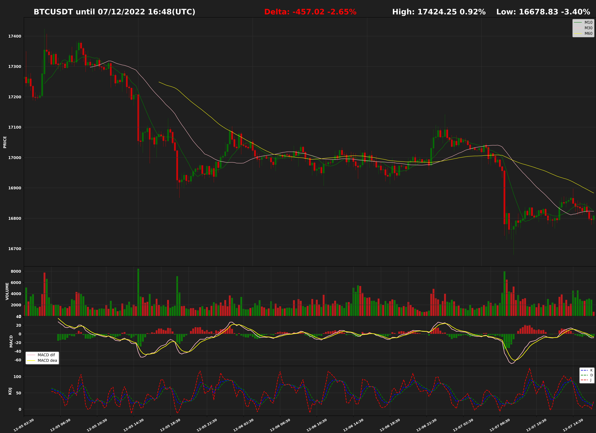
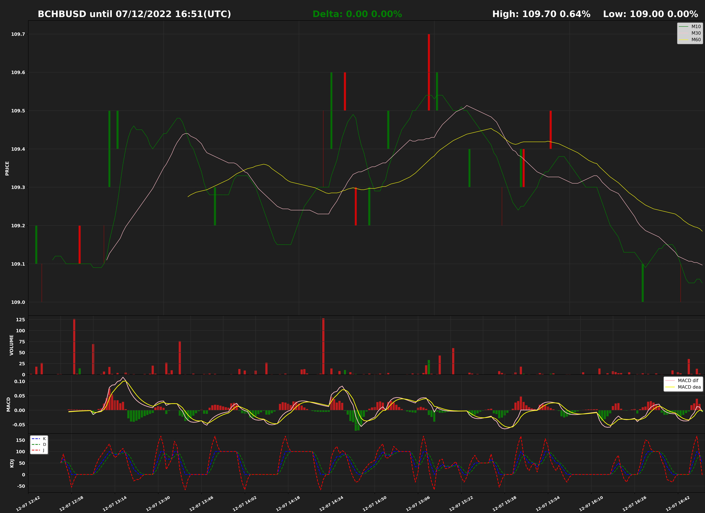

# Telegram cryptocurrency bot

#### Introduction

Store the token in TOKEN.txt

Project of Yang Chenran

Cryptocurrency price lookup bot. Supports querying prices, delta, high/low prices, drawing k-line/MACD/KDJ/MA lines and searchingO symbols with binance API.


#### Commands and usage

See the menu of bot

#### Example

```
/kq btcusdt
```



```
BTCUSDT from binance
Until 07/12/2022 16:48
Current: 16807.99
TimeZone: (UTC) Coordinated Universal Time
Volume Unit: Symbol
```

---

```
/km bchbusd
```



```
BCHBUSD from binance
Until 07/12/2022 16:51
Current: 109.00
TimeZone: (UTC) Coordinated Universal Time
Volume Unit: Symbol
```

---

