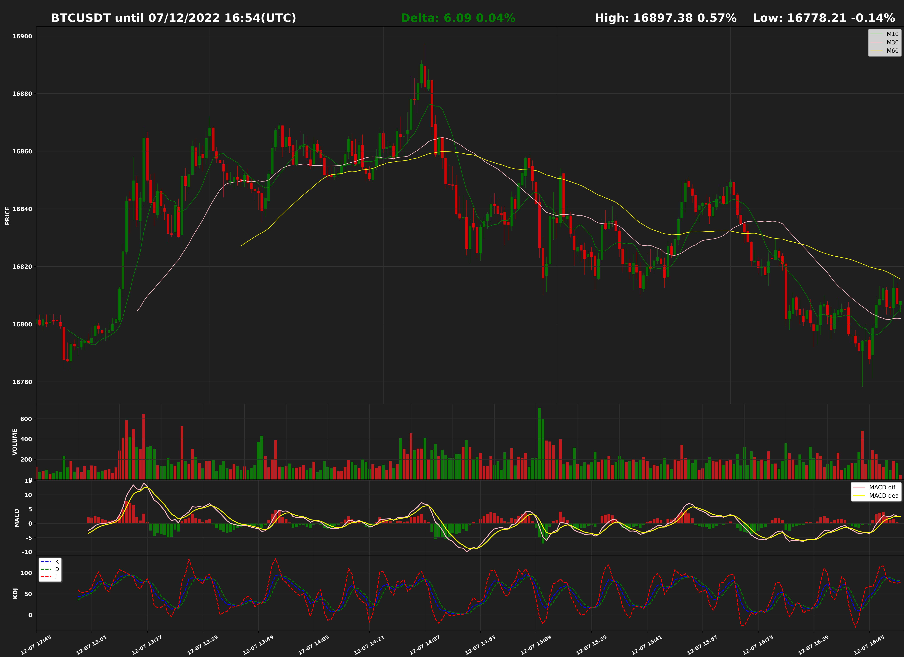

# rug-pull

#### Introduction

Cryptocurrency price lookup bot. Supports querying prices, delta, high/low prices and drawing k-line charts and search symbols with binance API.

You can find it on telegram [@rug_pull_bot](https://t.me/rug_pull_bot) .

#### Commands and usage

See the menu of [@rug_pull_bot](https://t.me/rug_pull_bot).

#### Example

```
/kq btcusdt
```


```
BTCUSDT from binance
Until 07/12/2022 16:48
Current: 16807.99
TimeZone: (UTC) Coordinated Universal Time
Volume Unit: Symbol
```

---

```
/km bchbusd
```



```
BCHBUSD from binance
Until 07/12/2022 16:51
Current: 109.00
TimeZone: (UTC) Coordinated Universal Time
Volume Unit: Symbol
```

---

If it doesn't respond, please contact me to run it)))